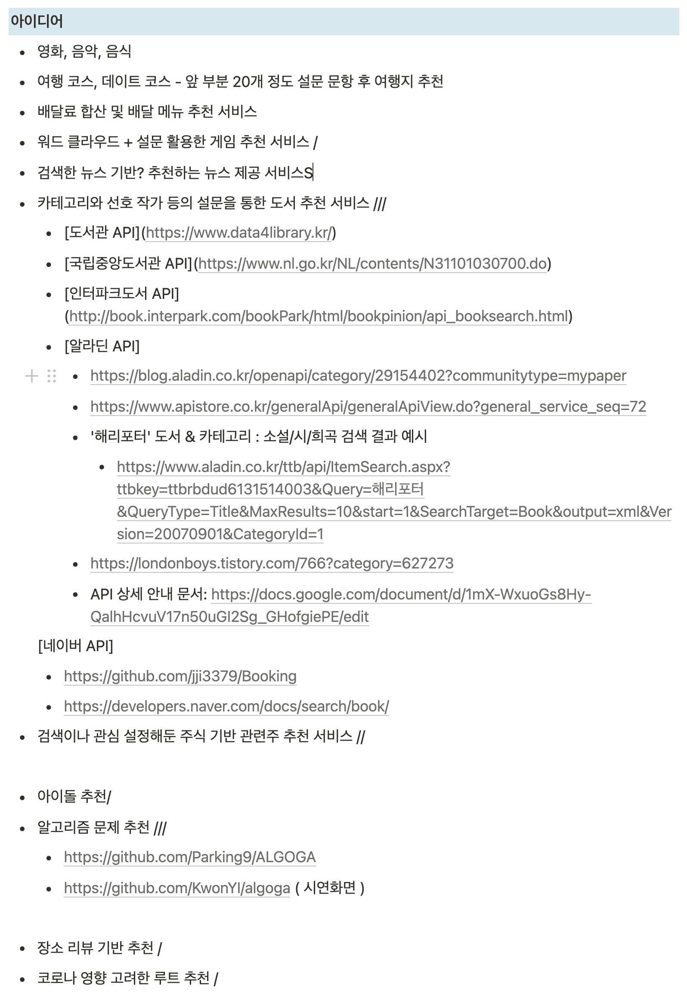
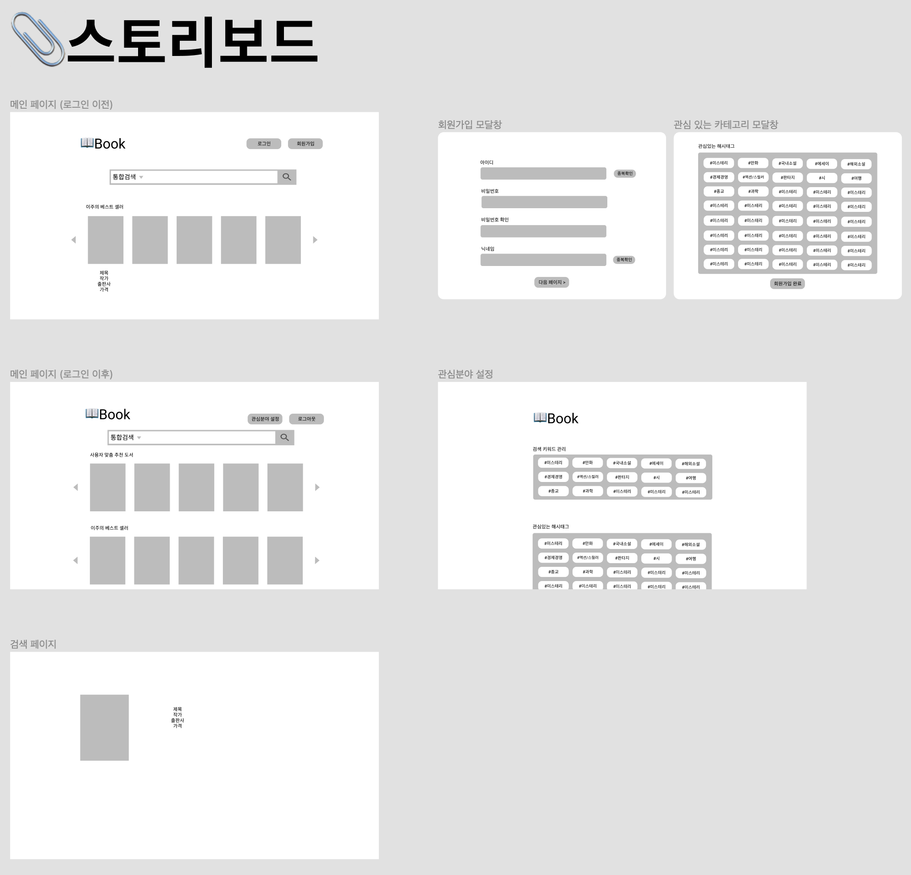

# 특화 프로젝트

### SSAFY 서울 6반 A604

### Member
|Name|Part|
|-|-|
|조규영|Backend|
|김낙현|Backend|
|김수연|PM|
|도태욱|Frontend|
|정원혁|Frontend|

 ## Sub-1 산출물

1. **아이디어 선정**

    

2. **와이어 프레임 -** [https://www.figma.com/file/i8OeT8X7F49lt3Hvij9jWk/SSAFY-특화-프로젝트?node-id=0%3A1](https://www.figma.com/file/i8OeT8X7F49lt3Hvij9jWk/SSAFY-%ED%8A%B9%ED%99%94-%ED%94%84%EB%A1%9C%EC%A0%9D%ED%8A%B8?node-id=0%3A1)

    

---

김낙현

- 아이디어 선정 및 회의
- 와이어프레임 제작
- Framework 학습

김수연

- 아이디어 브레인스토밍 (사례찾기)
- 아이디어 선정 및 회의
- 와이어프레임 제작

도태욱

- 아이디어 기획
- 와이어프레임 제작
- FrontEnd - vuex 학습

정원혁

- 아이디어 기획
- api 분석
- 간단 크롤링, 워드클라우드 학습

조규영 

- 아이디어 기획
- 명세서 과제 수행
- 활용 데이터 찾기
- 추천시스템 관련 자료 찾기

---
<br>


### 과제 수행

- package 설치

`pip install -r requirements.txt`

- Task 1~4

```
python parse.py                         # 1
python analyze.py                       # 2
python visualize.py                     # 3
python matrixFactorization.py           # 4
```